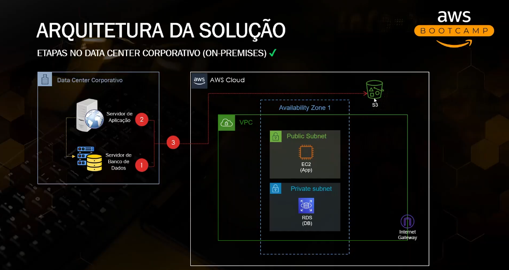

# Utilizando Terraform para provisior EC2 + RDS na AWS e Ansible para automatizar configuracöes na EC2.

Projeto de estudo que provisiona uma infraestrutura completa na AWS — VPC, EC2 e RDS (MySQL) — usando **Terraform** para a infraestrutura e **Ansible** para configuração e deploy da aplicação. O objetivo central é validar a comunicação entre uma instância EC2 e um banco RDS dentro de uma rede segmentada (subnets públicas e privadas).


## Arquitetura

- **VPC** com subnet pública (EC2) e duas subnets privadas (RDS, multi-AZ)
- **Internet Gateway** + route table para saída da subnet pública
- **EC2** rodando uma aplicação Flask, em subnet pública, acessível via SSH e HTTP na porta 8080
- **RDS MySQL** em subnet privada, acessível apenas pela EC2
- **ECR** (Elastic Container Registry) para armazenar a imagem Docker da aplicação

## Estrutura do repositório

```
├── ansible/
│   ├── deploy.yml            # Playbook principal (packages → db → app)
│   ├── hosts.ini             # Inventory da EC2
│   └── roles/
│       ├── packages/         # Instala dependências de sistema e libs Python
│       ├── db/                # Cria banco e tabela no RDS
│       └── app/               # Baixa, extrai e sobe a aplicação Flask (systemd)
├── app/
│   ├── app.py                 # Aplicação Flask (CRUD de usuários)
│   ├── requirements.txt
│   ├── dockerfile
│   ├── static/style.css
│   └── templates/              # index.html, add.html, edit.html
├── terraform/
│   ├── provider.tf             # Provider AWS + backend remoto (S3)
│   ├── variables.tf            # Variáveis do projeto
│   ├── modules.tf              # Chamada dos módulos (network, ec2_instance, database)
│   ├── ecr.tf                  # Repositório ECR
│   └── modules/
│       ├── network/            # VPC, subnets, route tables, IGW
│       ├── ec2_instance/       # EC2, key pair, security group
│       └── database/           # RDS, subnet group, security group
└── dockerfile
```

## Stack

- **Terraform** `6.54.0` (provider AWS)
- **Ansible** (playbooks + roles)
- **Python 3 / Flask 2.3.3** + **PyMySQL**
- **MySQL 8.0** (RDS)
- **Docker** + **Amazon ECR**

## Pré-requisitos

- Conta AWS com credenciais configuradas
- Terraform instalado (`>= 1.x`)
- Ansible instalado na máquina que vai orquestrar o deploy
- Par de chaves SSH gerado localmente (referenciado em `terraform/modules/ec2_instance/keypair.tf`)
- Bucket S3 já existente para o backend remoto do state (`igorrodriguesss-us-east-1-terraform-statefile`, configurável em `provider.tf`)

## Como rodar

### 1. Provisionar a infraestrutura

```bash
cd terraform
terraform init
terraform plan
terraform apply
```

Isso cria a VPC, subnets, EC2, RDS e o repositório ECR.

### 2.Configuração de variáveis com Ansible Vault

As credenciais sensíveis (como `db_password`) ficam em `group_vars/all/vault.yml`, criptografadas com **Ansible Vault**.  
As variáveis não sensíveis (como `db_host` e `db_user`) ficam em `group_vars/all/vars.yml`.

Para criar o arquivo `vault.yml` criptografado:
```bash
ansible-vault create group_vars/all/vault.yml
```
No arquivo group_vars/all/vars.yml:

```ini
db_host: mydb.xxxxx.us-east-1.rds.amazonaws.com
db_user: admin
```

### 3. Push do dockerfile para dentro do ECR

```ini
aws ecr get-login-password --region us-east-1 | docker login --username AWS --password-stdin <account_id>.dkr.ecr.us-east-1.amazonaws.com
docker build -t flaskapp:latest .
docker tag flaskapp:latest <account_id>.dkr.ecr.us-east-1.amazonaws.com/flask-app:latest
docker push <account_id>.dkr.ecr.us-east-1.amazonaws.com/flask-app:latest
```

### 4. Rodar o playbook

```bash
ansible-playbook -i hosts.ini deploy.yml --ask-vault-pass
```

O playbook executa, em ordem:
1. **packages** — instala dependências de sistema como python3-pymysql, baixa e instala AWS CLI
2. **db** — cria o banco `mydatabase` e a tabela `users` no RDS
3. **app** — baixa o dockerfile e sobe a Flask app via `Docker` (porta 8080)

## Pontos de atenção / possíveis evoluções

Como é um projeto de estudo focado na comunicação EC2 ↔ RDS, alguns pontos ficaram simplificados de propósito e valem como próximos passos:

- **Credenciais do banco**: hoje estão hardcoded em `app/app.py` e nas tasks do Ansible. Em um cenário real, migrar para variáveis de ambiente e/ou **Ansible Vault** / **AWS Secrets Manager**.
- **Security Groups abertos**: as regras de entrada (SSH, 8080, 3306) liberam `0.0.0.0/0`. Vale restringir a IPs específicos.
- **RDS multi-AZ**: está habilitado (`multi_az = true`), o que é ótimo para alta disponibilidade, mas aumenta custo — considerar `false` para ambientes de estudo.
## Licença

Projeto pessoal de estudo, sem licença específica definida.
